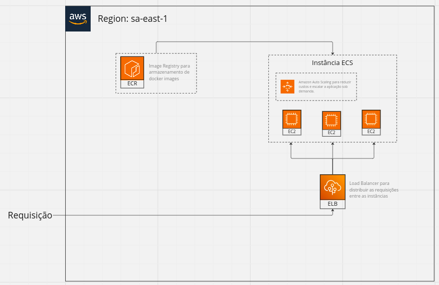

# API Pokemon

Essa aplicação tem como objetivo servir como uma ponte para algumas rotas da PokeAPI através de um middleware.

## Como rodar o projeto localmente

Para facilitar o trabalho de reprodução, compartilhamento, hosting e desenvolvimento da aplicação, tomamos a decisão de utilizar Docker e Docker Compose.

Para rodar a aplicação localmente, siga os passos abaixo:

- Instale uma versão acima da 16 de NodeJS.
- Instale uma versão acima da 8 do NPM.
- Clone a aplicação localmente.
- Acesse o diretório raiz da aplicação.
- Rode os comandos abaixo:

```shell
npm install
```

```shell
npm run docker:start
```

## Como rodar os testes

A aplicação foi desenvolvida primariamente com dois tipos de teste, end-to-end e unitários. Para rodar cada um deles, use os comandos abaixo para subir um container docker e rodar os testes nele:

Testes end-to-end:
```shell
npm run docker:test:e2e
```

Testes unitários:
```shell
npm run docker:test:unit
```

## Documentação da API

A aplicação oferece apenas 1 rota:

```
GET http://localhost:3000/api/v1/pokemon/{nome_do_pokemon}
```

Essa rota irá retornar as habilidades do pokemon sendo buscado no formato de uma array de strings.

### Exemplos de requisições

Requisição:

```shell
GET http://localhost:3000/api/v1/pokemon/pikachu
```

Retorno:

```json
["static", "lightning-rod"]
```

---

Requisição:

```shell
GET http://localhost:3000/api/v1/pokemon/ditto
```

Retorno:

```json
["limber", "imposter"]
```

## Como vamos subir essa aplicação

Como essa aplicação faz parte do core da ZRP, precisamos que ela atenda alguns requisitos, sendo eles:

- Alta disponibilidade
- Velocidade de entrega das requisições
- Baixo custo

Baseando nossa decisão nesses pontos, fizemos a escolha da AWS como nosso cloud e iremos utilizar apenas serviços disponibilizados pela mesma.

O diagrama abaixo representa nossa aplicação e os serviços que serão utilizados para atender a demanda:



## Explicação da Arquitetura

### AWS ECS e Auto-Scaling

Fizemos a escolha de utilizar o serviço de orquestramento de containers provido pela AWS para atender a demanda de alta disponibilidade e custo. ECS fará o papel de levantar e derrubar containers junto do serviço de auto-scaling a partir da demanda. Fizemos a escolha de ECS e não EKS pela facilidade de configuração, agilizando o nosso processo de levantar a aplicação e por não termos demandas de configuração tão avançadas em um primeiro momento.

### AWS ELB

Utilizaremos o Elastic Load Balancer para balancear as requisições entre as instâncias EC2, garantindo maior velocidade de entrega de dados. ELB trabalha muito bem com ECS e tornam uma aplicação altamente disponível juntos.

### AWS EC2

Dentro do nosso cluster do ECS teremos instâncias EC2 que servirão as aplicações em containers Docker.

### AWS ECR

ECR irá armazenar nossa imagem docker que será utilizada pelo ECS para criar instâncias da aplicação.
